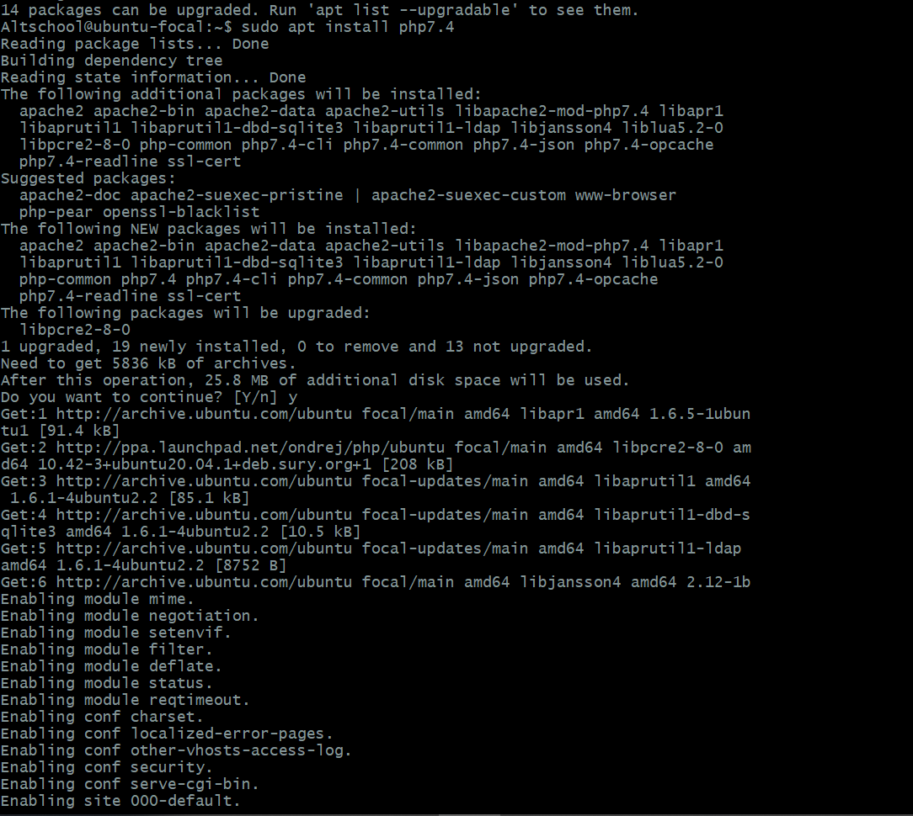
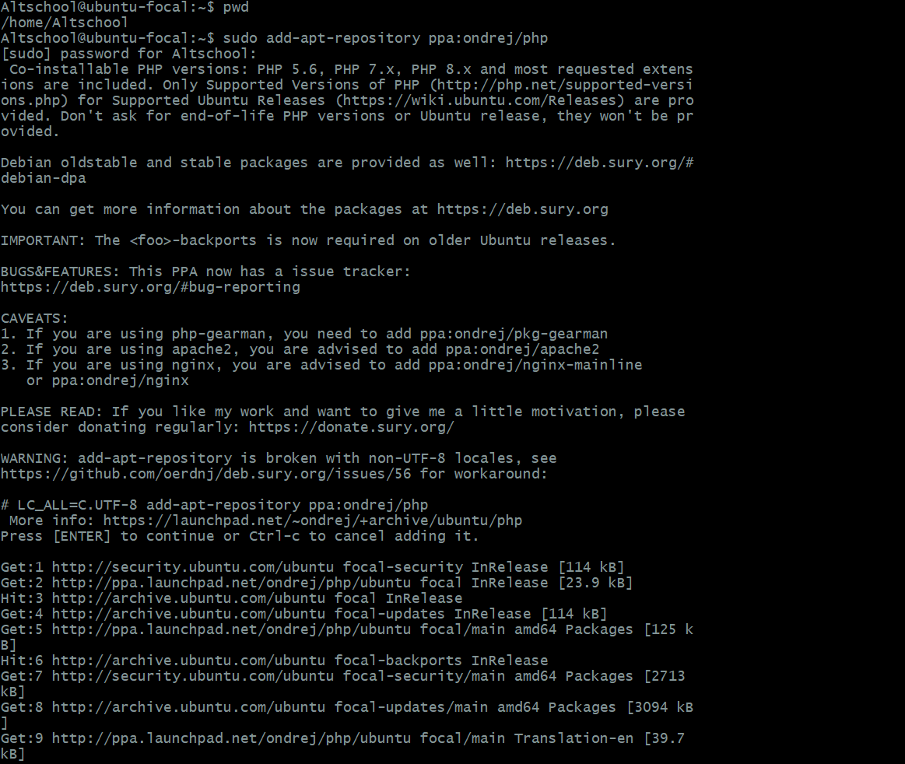
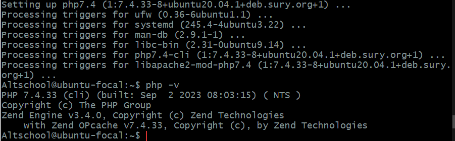
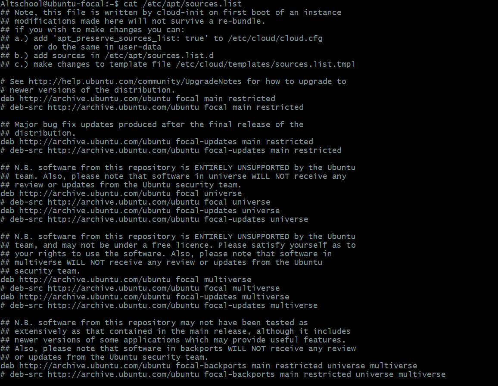
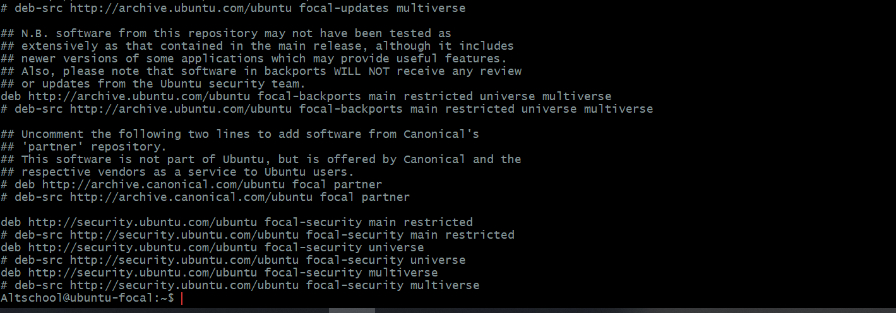

# phpinstall-task


- Install PHP 7.4 on your local linux machine using the ppa:ondrej/php package repo.
```
sudo apt install php7.4
```
 


- Learn how to use the add-apt-repository command
```
sudo add-apt-repository ppa:ondrej/php
```
 


- Display the installed php version
```
php-v 
```
 


- Submit the content of /etc/apt/sources.list
```
cat /etc/apt/sources.list
```
 
 


